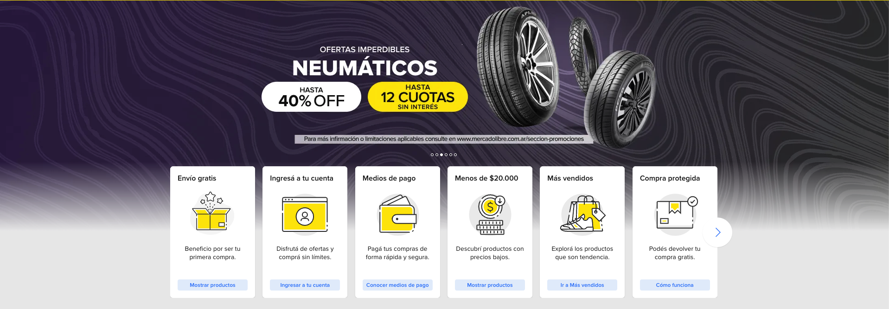
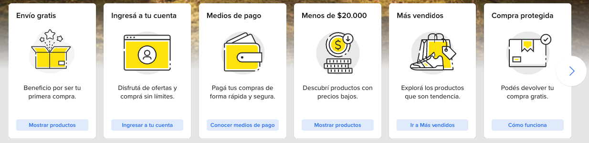
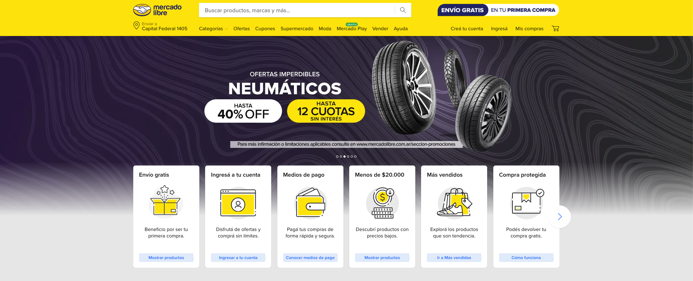

# Feature Specification: Home — Carousel Redesign

**Feature Branch**: `001-home-carousel-redesign`  
**Created**: 2026-03-05  
**Status**: Draft  
**Input**: User description: "Mejorar el aspecto del home: carousel fullscreen con autoplay para el banner publicitario y carousel de tarjetas flotante encima del banner"

## User Scenarios & Testing _(mandatory)_

### User Story 1 — Banner Publicitario en Carousel Fullscreen (Priority: P1)

> **Referencia visual**: 

Como visitante del home, quiero ver un banner publicitario que ocupe todo el ancho de la pantalla y rote automáticamente entre distintas promociones, para percibir el sitio como moderno y visualizar ofertas destacadas sin interacción manual.

**Why this priority**: El banner publicitario es el elemento visual principal del home. Presentarlo en formato fullscreen con autoplay incrementa inmediatamente el impacto visual y la percepción de profesionalismo, sin depender de otras funcionalidades.

**Independent Test**: Se puede probar abriendo el home y esperando: el banner debe mostrarse en ancho completo y avanzar al siguiente slide automáticamente cada 3 segundos. Valor entregable: home visualmente renovado con carousel funcional.

**Acceptance Scenarios**:

1. **Given** el usuario está en el home, **When** carga la página, **Then** el banner ocupa el 100% del ancho de la ventana con proporción `16/5` en escritorio y `4/3` en móvil (aspect-ratio), sin márgenes laterales visibles.
2. **Given** el carousel está activo, **When** transcurren 3 segundos sin interacción, **Then** el slide avanza al siguiente banner mediante un deslizamiento horizontal (`translateX`) de forma fluida.
3. **Given** el carousel muestra 3 banners, **When** se llega al último slide, **Then** el ciclo vuelve al primer banner (loop infinito).
4. **Given** el carousel está en autoplay, **When** el usuario hace hover o enfoca el carousel, **Then** el autoplay se pausa para no interrumpir la exploración manual.
5. **Given** el carousel tiene múltiples banners, **When** el usuario hace clic en los indicadores de posición (dots/bullets), **Then** el carousel navega directamente al slide correspondiente.

---

### User Story 2 — Carousel de Tarjetas de Acceso Rápido Flotante (Priority: P2)

> **Referencia visual — detalle de tarjeta**:  
>  

Como visitante del home, quiero ver las tarjetas de acceso rápido (Envío gratis, Medios de pago, Más vendidos, etc.) presentadas como un carousel horizontal flotando sobre el borde inferior del banner, para acceder rápidamente a secciones clave del sitio con un diseño visualmente atractivo.

**Why this priority**: Las tarjetas de acceso rápido son el segundo componente visual de mayor importancia. El efecto "flotante sobre el banner" replica fielmente el diseño de Mercado Libre Argentina y mejora la usabilidad sin requerir scroll.

**Independent Test**: Se puede probar verificando que las tarjetas aparecen superpuestas sobre el banner (z-index superior) y que el carousel permite deslizar/navegar horizontalmente entre tarjetas. Valor entregable: acceso rápido funcional con diseño mejorado.

**Acceptance Scenarios**:

1. **Given** el home está cargado, **When** el usuario visualiza la zona del banner, **Then** las tarjetas de acceso rápido se muestran parcialmente superpuestas sobre el borde inferior del banner (efecto flotante).
2. **Given** las tarjetas son más de las visibles simultáneamente, **When** el usuario desliza horizontalmente (swipe táctil o trackpad) o usa las flechas de navegación, **Then** el carousel se desplaza entre tarjetas con scroll nativo y `scroll-snap` para alineación precisa.
3. **Given** el carousel de tarjetas, **When** se muestran en escritorio, **Then** se visualizan al menos 5 tarjetas simultáneamente; en móvil, al menos 2.
4. **Given** cada tarjeta de acceso rápido, **When** el usuario la ve, **Then** muestra título, icono ilustrativo, descripción corta y un enlace de acción ("Mostrar productos", "Ingresar a tu cuenta", etc.).
5. **Given** el usuario hace clic en el CTA de una tarjeta, **When** la acción corresponde a mostrar productos, **Then** la página filtra o navega a la sección de productos pertinente.

---

### User Story 3 — Diseño Visual Alineado con Mercado Libre Argentina (Priority: P3)

> **Referencia visual — diseño objetivo completo**: 

Como visitante del home, quiero que el diseño general del home se parezca visualmente al home de Mercado Libre Argentina, para tener una experiencia familiar y profesional que inspire confianza.

**Why this priority**: La coherencia visual con la referencia de diseño (MeLi AR) es un criterio indirecto que se satisface en gran medida al implementar P1 y P2 correctamente. Se lista como P3 porque depende de los otros dos y no agrega funcionalidades nuevas.

**Independent Test**: Se puede validar comparando el home con capturas de referencia de MeLi AR: banner fullscreen, tarjetas flotantes, paleta amarillo/blanco/gris. Valor entregable: presentación de diseño aprobable.

**Acceptance Scenarios**:

1. **Given** el home con P1 y P2 implementados, **When** un evaluador lo compara con la referencia visual provista, **Then** la disposición general (banner fullscreen + tarjetas flotantes + grilla de productos) es reconociblemente similar.
2. **Given** el diseño final, **When** se inspecciona en escritorio (≥1280px), **Then** las proporciones del banner, las tarjetas y la grilla de productos son coherentes con la referencia.
3. **Given** el diseño final, **When** se inspecciona en móvil (≤768px), **Then** el layout se adapta correctamente sin desbordamientos ni solapamientos indeseados.

---

### Edge Cases

- ¿Qué ocurre si una imagen del banner no carga? → El slide muestra un fondo de color sólido con el texto de la oferta sin romper el carousel.
- ¿Qué sucede si el usuario navega fuera del home mientras el autoplay está activo? → El autoplay se detiene (limpieza del temporizador) para no consumir recursos innecesariamente.
- ¿Qué pasa si hay menos de 3 banners configurados? → El carousel funciona con los banners disponibles; si hay 1, no muestra controles de navegación.
- ¿Cómo se comporta el carousel de tarjetas si JavaScript está deshabilitado o falla? → Las tarjetas se muestran en grilla estática como fallback.
- ¿Qué ocurre si el sistema operativo tiene `prefers-reduced-motion: reduce` activo? → El autoplay continúa cada 3 s pero las transiciones entre slides son instantáneas (sin animación de deslizamiento ni fade).
- ¿Qué sucede si el ancho de la ventana es muy pequeño (< 320px)? → El banner colapsa a altura mínima y las tarjetas se muestran en columna sin desbordamiento.

## Requirements _(mandatory)_

### Functional Requirements

- **FR-001**: El sistema DEBE mostrar un carousel de banners publicitarios que ocupe el 100% del ancho de la ventana (fullscreen horizontal) con altura definida por aspect-ratio: `16/5` en escritorio (≥768px) y `4/3` en móvil (<768px).
- **FR-002**: El carousel de banners DEBE contener exactamente 3 slides con imágenes ilustrativas de ofertas.
- **FR-003**: El carousel de banners DEBE avanzar automáticamente al siguiente slide cada 3 segundos (autoplay) usando una transición de deslizamiento horizontal (`transform: translateX`).
- **FR-004**: El autoplay del carousel de banners DEBE pausarse cuando el usuario coloca el cursor sobre el carousel o lo enfoca por teclado.
- **FR-004b**: El carousel DEBE detectar la preferencia de sistema `prefers-reduced-motion: reduce`; cuando está activa, las transiciones entre slides son instantáneas (sin animación CSS), pero el autoplay sigue activo cada 3 segundos.
- **FR-005**: El carousel de banners DEBE tener loop infinito: al terminar el último slide, vuelve al primero.
- **FR-006**: El carousel de banners DEBE mostrar indicadores de posición (dots o bullets) que permitan navegar directamente a cualquier slide.
- **FR-007**: El sistema DEBE reemplazar la grilla estática de tarjetas de acceso rápido por un carousel horizontal de tarjetas.
- **FR-008**: El carousel de tarjetas DEBE posicionarse visualmente superpuesto (flotante) sobre el borde inferior del banner publicitario.
- **FR-009**: Cada tarjeta del carousel DEBE mostrar: título, SVG inline monocromático ad-hoc como ícono, descripción corta y un enlace/botón de acción.
- **FR-010**: El carousel de tarjetas DEBE mostrar al menos 6 tarjetas en total (Envío gratis, Ingresá a tu cuenta, Medios de pago, Menos de $20.000, Más vendidos, Compra protegida), navegables horizontalmente.
- **FR-011**: El carousel de tarjetas DEBE ser navegable mediante flechas anteriores/siguientes visibles en los extremos del contenedor, y mediante scroll horizontal nativo (`overflow-x: scroll` + `scroll-snap`) que soporte swipe táctil y trackpad automáticamente.
- **FR-012**: En dispositivos móviles, el carousel de tarjetas DEBE mostrar al menos 2 tarjetas visibles simultáneamente; en escritorio, al menos 5.
- **FR-013**: Las tarjetas del carousel DEBEN tener fondo blanco, bordes redondeados, sombra sutil y efecto de elevación al hacer hover.
- **FR-014**: Si una imagen de banner no carga, el slide DEBE mostrar un fondo de color con texto de la oferta como fallback.

### Key Entities

- **BannerSlide**: Representa un slide del carousel. Atributos: imagen de fondo (URL), texto principal, subtexto, etiqueta de oferta, enlace de destino.
- **QuickAccessCard**: Representa una tarjeta de acceso rápido. Atributos: título, ícono SVG inline monocromático (creado ad-hoc en el componente, sin dependencias externas), descripción, texto del CTA, URL de destino.
- **HeroBannerCarousel**: Componente contenedor del carousel de banners. Gestiona estado de slide activo, temporizador de autoplay, loop y pausa por hover.
- **BenefitsCarousel**: Componente contenedor del carousel de tarjetas flotante. Gestiona el scroll horizontal y la visibilidad parcial de tarjetas adyacentes.

## Success Criteria _(mandatory)_

### Measurable Outcomes

- **SC-001**: El banner publicitario ocupa el 100% del ancho de la ventana con aspect-ratio `16/5` en escritorio (≥768px) y `4/3` en móvil (<768px), verificable en todos los breakpoints ≥ 320px sin desbordamiento horizontal.
- **SC-002**: La transición entre slides del banner ocurre en un intervalo de 3 segundos ± 200ms, medible sin interacción del usuario.
- **SC-003**: El carousel de tarjetas flotante se superpone visualmente al banner con al menos 40px de solapamiento vertical, visible en escritorio.
- **SC-004**: El diseño del home es reconocido como similar al home de Mercado Libre Argentina por al menos 4 de 5 evaluadores en una revisión de pares.
- **SC-005**: El carousel de tarjetas permite ver las 6 tarjetas de acceso rápido sin necesidad de scroll de página (solo interacción con el carousel).
- **SC-006**: No existen errores de consola relacionados con el carousel al cargar la página ni durante el ciclo de autoplay.

## Clarifications

### Session 2026-03-05

- Q: ¿El autoplay del carousel respeta la preferencia de sistema `prefers-reduced-motion`? → A: Detectar `prefers-reduced-motion`: usar transición instantánea (sin animación CSS) pero mantener el avance automático cada 3 s.
- Q: ¿Qué tipo de transición se usa entre slides del banner? → A: Slide horizontal — deslizamiento lateral mediante `transform: translateX`.
- Q: ¿Cómo se define la altura del banner fullscreen? → A: Aspect-ratio proporcional — `16/5` en escritorio, `4/3` en móvil; sin valores fijos en píxeles ni viewport height.
- Q: ¿El carousel de tarjetas soporta swipe táctil en móvil? → A: Scroll horizontal nativo con `scroll-snap` — el swipe táctil y el scroll de trackpad funcionan automáticamente sin eventos touch manuales.
- Q: ¿De dónde provienen los íconos de las tarjetas de acceso rápido? → A: SVGs inline ad-hoc creados directamente en el componente, estilo línea monocromática, sin dependencias externas.

## Assumptions

- Las imágenes de los 3 banners serán ilustrativas (obtenidas de la web pública de Mercado Libre Argentina o assets ya existentes en el repo); no se requieren imágenes de producción reales.
- Los íconos de las tarjetas de acceso rápido serán SVGs inline monocromáticos creados ad-hoc directamente en el componente `QuickAccessCard`, sin dependencias externas de librerías de íconos.
- Las tarjetas de acceso rápido no requieren conectividad con datos reales del backend; sus destinos son rutas internas del prototipo o anclas `#`.
- El diseño de referencia oficial es el home de Mercado Libre Argentina (https://www.mercadolibre.com.ar/) tal como se muestra en las imágenes adjuntas por el usuario.
- El stack de implementación es el existente en el monorepo: React, TypeScript, Tailwind CSS v4, componentes en `libs/ui-components`.
- No se requiere soporte para Internet Explorer ni navegadores legacy.
- **Dot indicators**: estado activo = círculo amarillo (#FFE600) 10px; estado inactivo = círculo blanco/gris 6px con opacidad 60%; hover = opacidad 100%. [CHK003]
- **Loading/skeleton**: durante el estado de carga del home, los carousels muestran un `div` con el mismo aspect-ratio/height relleno con `bg-gray-200 animate-pulse`. [CHK005]
- **Texto sobre banners**: color blanco semibold con `drop-shadow` oscuro. Contraste adecuado asegurado por assets controlados (SVG/PNG propios). Auditoría WCAG formal fuera del alcance. [CHK006, CHK015]
- **Indicador visual de pausa**: no se muestra ningún indicador al pausar el autoplay por hover/focus. Comportamiento coherente con el carousel de MeLi AR. [CHK009]
- **slides.length === 1**: el autoplay se desactiva (`enabled: false` en `useAutoplay`). Controles de navegación ya ocultos por FR-006. [CHK012]
- **ARIA del HeroBannerCarousel**: `role="region"` con `aria-label="Banner publicitario"`; slide activo anunciado via elemento oculto con `aria-live="polite"`. Dots con `aria-label={\`Ir al slide ${index + 1}: ${slide.title}\`}`. [CHK013, CHK016]
- **Navegación por teclado**: `Tab` navega entre dots y flechas visibles; `Enter`/`Space` los activa. No se requiere soporte de teclas de flecha (←/→) para el carousel de banners. [CHK014]
- **Flechas de BenefitsCarousel**: `aria-label="Tarjeta anterior"` (flecha izquierda) y `aria-label="Tarjeta siguiente"` (flecha derecha). [CHK017]
- **slides/cards vacíos**: `HeroBannerCarousel` retorna `null` si `slides.length === 0`; `BenefitsCarousel` retorna `null` si `cards.length === 0`. Si `cards.length` es menor a la cantidad visible, las flechas se ocultan. [CHK020, CHK022]
- **Altura mínima a < 320px**: no se define altura mínima fija. `aspect-[4/3]` es proporcional y produce altura correcta a cualquier ancho (ej. 280px → 210px). [CHK024]
- **JavaScript requerido**: la SPA (Vite/React) requiere JavaScript habilitado. El fallback para JS deshabilitado no aplica a ningún componente de la feature. [CHK025]
